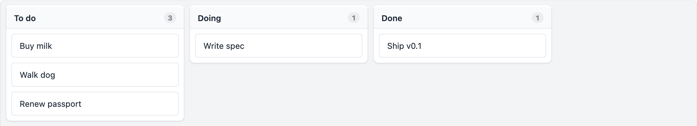
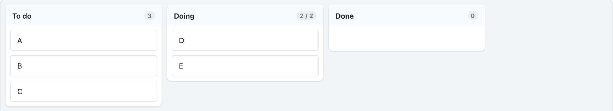
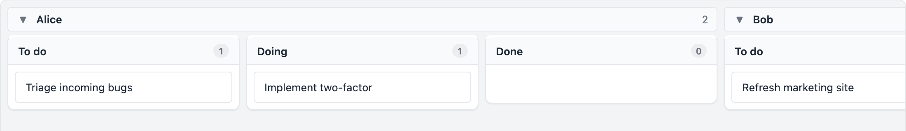
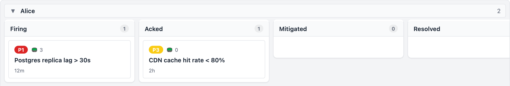
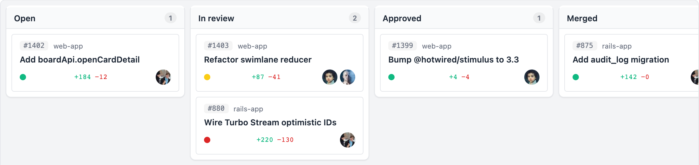
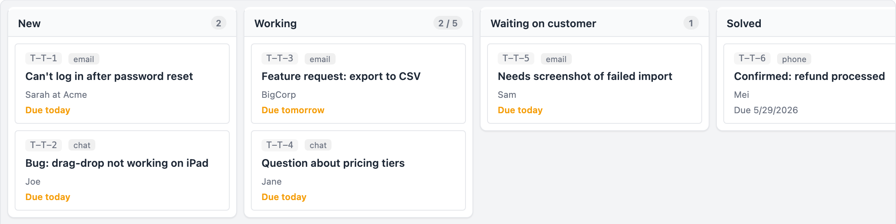
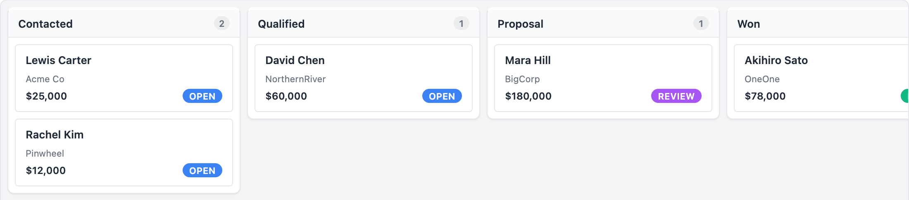
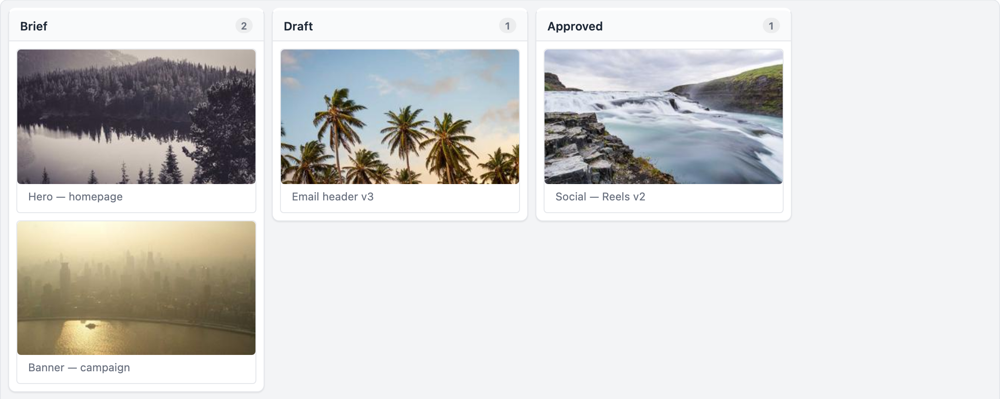

# stimulus_kanban

[](https://github.com/schappim/stimulus_kanban/actions/workflows/ci.yml)
[](https://www.npmjs.com/package/@ninjaai/stimulus_kanban)
[](https://rubygems.org/gems/stimulus_kanban_rails)

An **HTML-first kanban board for [Stimulus.js](https://stimulus.hotwired.dev/) (Hotwire)**.

Your board is just a semantic `<ol>` / `<li>` list of columns and cards. It renders without JavaScript, then progressively enhances into a full drag-and-drop board. No React, no build-time config object, no third-party kanban framework — just `data-controller="board"` on a `<div>` and `data-*` attributes on the columns and cards.



<table>
  <tr>
    <td width="50%">
      <a href="docs/screenshots/wip-limits.png"></a>
      <p align="center"><sub><b>WIP limits</b> — per-column caps with <code>board:wipExceeded</code></sub></p>
    </td>
    <td width="50%">
      <a href="docs/screenshots/swimlanes.png"></a>
      <p align="center"><sub><b>Swimlanes</b> — bucket every column by any card field</sub></p>
    </td>
  </tr>
  <tr>
    <td>
      <a href="docs/screenshots/incident.png"></a>
      <p align="center"><sub><b><code>incident</code> renderer</b> — priority pills, affected services, age</sub></p>
    </td>
    <td>
      <a href="docs/screenshots/pr-review.png"></a>
      <p align="center"><sub><b><code>pr</code> renderer</b> — CI status, +/− diffstat, reviewers</sub></p>
    </td>
  </tr>
  <tr>
    <td>
      <a href="docs/screenshots/support-inbox.png"></a>
      <p align="center"><sub><b><code>support-ticket</code> renderer</b> — channel, requester, due date</sub></p>
    </td>
    <td>
      <a href="docs/screenshots/leads-pipeline.png"></a>
      <p align="center"><sub><b><code>lead</code> renderer</b> — company, deal value, stage pill</sub></p>
    </td>
  </tr>
  <tr>
    <td colspan="2">
      <a href="docs/screenshots/image-cards.png"></a>
      <p align="center"><sub><b><code>image-card</code> renderer</b> — cover thumbnail with click-to-zoom</sub></p>
    </td>
  </tr>
</table>

Every screenshot above is a [live demo page](demo/) — `npm run dev` and open `/demo/`.

## What you get

- **Drag-and-drop** — between and within columns, multi-card move that preserves order, programmatic drag for tests, and a cancellable `board:beforeMove` event so you can veto invalid transitions.

- **Workflow controls** — WIP limits with a `board:wipExceeded` signal (fired once per crossing), per-column `accept-cards-from` allow-lists, sort modes (manual / asc / desc), and a `read-only` toggle.

- **Board structure** — swimlanes (bucket every column by any card field), column collapse / hide / reorder / resize, inline "+ Add card" / "+ Add column" affordances, and a card detail panel (popover or side rail).

- **Scale & search** — virtual scrolling per column (auto-on past a threshold), a global quick filter with hide-or-dim modes, a custom `setCardFilter(predicate)` hook, and a `server-side` mode for paged columns.

- **Editing** — inline card editing, custom card renderers **and editors** via `<template>` elements, and drag-to-attach files (cancellable `board:fileAttached`).

- **Persistence** — set `persist-key` and column order / widths / collapse state / hidden columns / swimlane / quick filter / sort round-trip through `localStorage`.

- **13 built-in card renderers** — `story`, `task`, `bug`, `incident`, `note`, `pr`, `support-ticket`, `lead`, `order`, `email-thread`, `image-card`, `cover-progress`, `gantt-stub` — plus composable sub-renderers (status pill, avatar, tags, currency, progress bar, due date…). See [Built-in card renderers](#built-in-card-renderers).

- **A public `boardApi`** with movement, selection, filter, sort, swimlane, persistence, and CSV/JSON export — plus a full keyboard map for non-mouse use.

## With Rails

Prefer a server-driven version with live multi-user moves? The optional [`stimulus_kanban_rails`](gem/stimulus_kanban_rails) companion streams every move/edit to every connected client over Turbo Streams (Action Cable), with optimistic updates, server-side workflow guards, and an audit log ready for undo/redo.

See the **Rails & Hotwire** section below, or jump straight to [`gem/stimulus_kanban_rails/README.md`](gem/stimulus_kanban_rails/README.md). LLM-friendly usage docs live in [`skills/`](skills).

---

## Install

**Option A — plain `<script>` (no bundler).** Self-contained IIFE bundle
with Stimulus included; works over `file://`, a static server, anything.

```html
<link rel="stylesheet" href="https://unpkg.com/@ninjaai/stimulus_kanban/dist/stimulus_kanban.css" />
<script src="https://unpkg.com/@ninjaai/stimulus_kanban/dist/stimulus_kanban.js"></script>
<script> StimulusKanban.start() </script>
```

**Option B — npm + a bundler (Vite, esbuild, webpack…).** Stimulus is a
peer dependency, so install it alongside:

```bash
npm install @ninjaai/stimulus_kanban @hotwired/stimulus
```

```js
import { Application } from "@hotwired/stimulus"
import StimulusKanban from "@ninjaai/stimulus_kanban"   // resolves to dist/stimulus_kanban.esm.js
import "@ninjaai/stimulus_kanban/style.css"

const app = Application.start()
StimulusKanban.start(app)
```

`StimulusKanban.start(app?)` registers all controllers (`board`,
`board-column`, `card`, `card-editor`, `swimlane-header`, `column-menu`)
on the given Stimulus `Application` (or starts a new one) and returns
it.

**Option C — Rails / Hotwire (gem from RubyGems).** The
[`stimulus_kanban_rails`](https://rubygems.org/gems/stimulus_kanban_rails)
gem bundles this board *and* the live-sync layer, importmap-pinned — no
JS build, no `dist/` to vendor:

```bash
bundle add stimulus_kanban_rails
```

Full setup (importmap, stylesheet, routes, optional migration) is in
the **Rails & Hotwire** section below.

## Quick start

```html
<link rel="stylesheet" href="dist/stimulus_kanban.css" />

<div data-controller="board" style="height: 540px">
  <ol class="sk-columns">
    <li data-controller="board-column"
        data-board-column-id-value="todo"
        data-board-column-title-value="To do">
      <ol class="sk-cards">
        <li data-card-id="1">Buy milk</li>
        <li data-card-id="2">Walk dog</li>
      </ol>
    </li>
    <li data-controller="board-column"
        data-board-column-id-value="doing"
        data-board-column-title-value="Doing">
      <ol class="sk-cards">
        <li data-card-id="3">Write spec</li>
      </ol>
    </li>
    <li data-controller="board-column"
        data-board-column-id-value="done"
        data-board-column-title-value="Done">
      <ol class="sk-cards"></ol>
    </li>
  </ol>
</div>

<script src="dist/stimulus_kanban.js"></script>
<script>StimulusKanban.start()</script>
```

Cards can be **server-rendered** (as above — parsed into the dataset on
connect), **loaded from a URL**
(`data-board-card-data-url-value="/cards.json"`), or set in JS via
`element.boardApi.setCardData([...])`.

## Board attributes (`data-board-*-value`)

| Attribute | Meaning |
|---|---|
| `card-data-url` | URL returning `{ columns: [...], cards: [...] }` |
| `card-selection` | `""` \| `"single"` \| `"multiple"` |
| `card-multi-select-with-click` | multi-select on plain click (no modifier) |
| `suppress-card-click-selection` | don't select on card click |
| `card-height` | `"auto"` \| pixel number (uniform rows enable virtualisation) |
| `column-width` | default pixel width per column (default `280`) |
| `gap` | pixel gap between columns and between cards (default `8`) |
| `virtual` / `virtual-threshold` | force virtual scrolling inside a column / auto-on cards-per-column threshold |
| `height` | CSS height of the board viewport (e.g. `"640px"`) |
| `get-card-id` | card-object field used as identity (default `id`) |
| `get-column-id` | card-object field that holds the *current* column id (default `column_id`) |
| `dom-layout` | `""` \| `"autoHeight"` |
| `server-side` | server-side card model: `setCardData` represents the currently-loaded window; column totals come from `setColumnCounts` |
| `swimlane-field` | card field used to bucket every column horizontally into swimlanes |
| `wip-limits` | JSON map `{ columnId: number }` overlaid on `data-board-column-wip-value` |
| `quick-filter` | initial value of the global card search |
| `filter-mode` | `"hide"` (default) \| `"dim"` |
| `card-renderer` | board-wide default renderer name or template id |
| `card-editor` | board-wide default editor template id |
| `card-detail-template` | template id cloned into the card detail panel |
| `detail-layout` | `"popover"` (default) \| `"rail"` |
| `detail-width` | rail-layout width in px (default `360`) |
| `drag-handle-selector` | CSS selector for the drag handle inside a card (default: whole card draggable) |
| `read-only` | disable drag/drop, inline edit, add-card |
| `persist-key` | when non-empty, auto-save/restore column order, widths, collapse state, hidden columns, swimlane, quick filter, sort to `localStorage["skanban:" + persistKey]` |
| `add-card` / `add-column` | `true` to render the inline "+ Add card" / "+ Add column" affordances (default `false`) |
| `accept-files` / `attachments-field` | drag-to-attach: dropping files on a card dispatches a cancellable `board:fileAttached` event |

## Column attributes (`data-board-column-*-value`, on each column root)

`id` (required) · `title` · `wip` · `min-count` (advisory) · `width` ·
`collapsed` · `hidden` · `accept-cards-from` (JSON array of column ids) ·
`disallow-drag` · `sort` (`manual` \| `asc:<field>` \| `desc:<field>`) ·
`card-renderer` · `card-editor` · `add-card-label` · `color` · `icon`.

## Card attributes (`data-card-*`)

`data-card-id` (required) · `data-column-id` · `data-card-order` ·
`data-card-renderer` · `data-card-editor` · `data-card-locked` ·
`data-card-color` · `data-card-swimlane` · `data-card-json` (single JSON
payload for renderers that prefer one object).

## Public API — `element.boardApi`

Available right after the `board:ready` event:

```js
board.addEventListener("board:ready", (e) => {
  const api = e.detail.api
  api.setCardData([{ id: 1, column_id: "todo", title: "Add tests" }])
  api.moveCard("3", { toColumnId: "done", toIndex: 0 })
  api.setQuickFilter("bug")
  api.openCardDetail("3")
})
```

Highlights:

- **Data:** `setCardData(cards)`, `getCardData()`, `setColumnData(cols)`,
  `getColumnData()`, `applyTransaction({add, update, remove, move})`,
  `setColumnCounts({colId: total})` / `getColumnCounts()` (server-side)
- **Card selection:** `getSelectedCardIds`, `getSelectedCards`,
  `selectCard`, `deselectCard`, `selectAllInColumn`, `clearSelection`
- **Movement:** `moveCard(cardId, { toColumnId, toIndex })`,
  `moveCards([cardId], target)` (multi-move preserves order),
  `reorderCardWithinColumn`, `bulkMove`
- **Columns:** `setColumnVisible/Collapsed/Width/Wip/AcceptFrom`,
  `moveColumn`, `sizeColumnsToFit`
- **Swimlanes:** `setSwimlaneField`, `getSwimlaneField`,
  `setSwimlaneCollapsed`, `getSwimlaneCollapsedSet`
- **Sort:** `setColumnSort`, `getColumnSort`
- **Filter:** `setQuickFilter`, `getQuickFilter`, `setCardFilter(predicate)`
- **Editing:** `startEditingCard(id)`, `commitEditing()`,
  `cancelEditing()`
- **Programmatic drag:** `beginDrag([ids], fromColumnId)` /
  `endDrag({ toColumnId, toIndex, cancelled })` — the test-harness path
- **WIP:** `getWipState()` → `[{colId, count, limit, over}]`
- **Persistence:** `getBoardState`, `applyBoardState`,
  `clearPersistedState`, `getPersistKey`
- **Export:** `getDataAsJson()`, `getDataAsCsv({columns, swimlanes})`
- **Detail panel:** `openCardDetail(id)`, `closeCardDetail`,
  `isCardDetailOpen`

## Events (bubble off the board element)

`board:ready` · `board:cardDataChanged` · `board:columnDataChanged` ·
`board:cardClicked` · `board:cardDblClicked` ·
`board:cardSelectionChanged` · `board:cardEditStarted` ·
`board:cardValueChanged` · `board:cardEditCancelled` ·
**`board:beforeMove`** (cancellable) · `board:cardMoved` ·
`board:cardsMoved` (multi) · `board:cardAdded` · `board:cardRemoved` ·
`board:columnMoved` · `board:columnVisibleChanged` ·
`board:columnCollapsedChanged` · `board:columnResized` ·
`board:columnSortChanged` · **`board:wipExceeded`** (once per crossing) ·
`board:filterChanged` · `board:swimlaneChanged` ·
`board:boardStateApplied` · `board:cardDetailOpened` ·
`board:cardDetailClosed` · **`board:fileAttached`** (cancellable) ·
`board:columnFetchMore` (server-side).

```js
board.addEventListener("board:beforeMove", (e) => {
  if (e.detail.toColumnId === "done" && !canMarkDone(e.detail.cardIds)) {
    e.preventDefault()
  }
})
board.addEventListener("board:cardMoved", (e) => save(e.detail))
```

## Custom card renderers & editors

Same shape as `stimulus_grid`:

```html
<template id="story-card">
  <article class="sk-card">
    <header>
      <span class="sk-card-key" data-bind="key"></span>
      <span class="sk-pill" data-bind="status" data-bind-attr="data-status:status"></span>
    </header>
    <h4 class="sk-card-title" data-bind="title"></h4>
    <footer>
      <span class="sk-card-points" data-bind="points"></span>
      
    </footer>
  </article>
</template>

<template id="story-editor">
  <form class="sk-card-editor">
    <input data-editor-input data-editor-field="title" />
    <select data-editor-field="points">
      <option>1</option><option>2</option><option>3</option><option>5</option>
    </select>
    <button data-editor-commit>Save</button>
    <button data-editor-cancel type="button">Cancel</button>
  </form>
</template>

<div data-controller="board"
     data-board-card-renderer-value="story-card"
     data-board-card-editor-value="story-editor">…</div>
```

Renderer contract: `data-bind="field"` → element text;
`data-bind-text="field"` → optionally formatted; `data-bind-attr="attr:field"`
→ set attribute (multiple pairs allowed per element).

Editor contract: inputs marked `[data-editor-field="<f>"]` are seeded
from the card on open and read back into `{ field: value }` on commit.
Enter / Tab commits; Esc cancels; the editor's
`[data-editor-commit]` / `[data-editor-cancel]` buttons trigger the same
handlers.

## Built-in card renderers

| Renderer | Use for |
|---|---|
| `story` | title + key + status pill + assignee + points |
| `task` | title + checkbox completion + due date |
| `bug` | title + severity badge + reporter avatar |
| `incident` | title + priority + paging count + time-since-open |
| `note` | freeform text card with author + relative time |
| `pr` | PR title + repo + reviewer avatars + CI dot + diff stats |
| `support-ticket` | subject + customer + channel icon + SLA countdown |
| `lead` | name + company + value (currency) + stage |
| `order` | order # + status pill + total + items count |
| `email-thread` | subject + sender + snippet + unread dot |
| `image-card` | hero image + caption (with click-to-zoom) |
| `cover-progress` | hero image + bottom progress bar |
| `gantt-stub` | label + due-window bar (visual only — no real timeline) |

Sub-renderers (`statusPill`, `avatar`, `tags`, `currency`, `percent`,
`progressBar`, `relativeTime`, `dueDate`, `countryFlag`, `attachments`,
`mask`) live under `renderers.sub` so a custom card can compose them.

## Keyboard

`↑/↓` move active card within column · `←/→` move across columns ·
`Cmd/Ctrl+↑/↓/←/→` actually moves the card (fires `board:beforeMove`)
· `Enter` opens the detail / editor · `Space` toggles selection ·
`Cmd/Ctrl+A` selects all in active column · `Cmd/Ctrl+C` copies
selected cards as JSON · `Esc` cancels mid-drag.

## Rails & Hotwire

The companion gem [`stimulus_kanban_rails`](gem/stimulus_kanban_rails)
ships a Ruby DSL for declaring boards, a Broadcastable mixin for AR
models, and a Turbo Stream sync layer that wires `board:cardMoved` /
`board:cardValueChanged` to a JSON cards endpoint:

```ruby
class SprintBoard < StimulusKanbanRails::Board
  resource :stories
  model    Story
  stream_name { |_user| "sprint:current" }

  column :todo,  title: "To do",  wip: 5
  column :doing, title: "Doing",  wip: 3, accept_from: %i[todo]
  column :done,  title: "Done",   accept_from: %i[doing]

  card_field :title,  type: :string,  editable: true
  card_field :points, type: :integer, editable: true,
                      validate: ->(v, _) { "1–13 only" unless (1..13).cover?(v.to_i) }

  before_move ->(card, from:, to:, user:) {
    raise StimulusKanbanRails::Veto, "needs points" if to == :doing && card.points.blank?
  }
end
```

```erb
<%= stimulus_kanban_board(
      board: SprintBoard.new(user: current_user),
      cards: Story.current_sprint,
      card_selection: "multiple") %>
```

See [`gem/stimulus_kanban_rails/README.md`](gem/stimulus_kanban_rails/README.md)
for install, broadcasting, audit log, and the full endpoint surface.

## Project layout

```
stimulus_kanban/
├── README.md
├── DESIGN.md                      # architecture + DnD state machine
├── REQUIREMENTS.md                # the original spec
├── package.json
├── vite.config.js                 # demo dev server
├── vite.lib.config.js             # IIFE + ESM bundle
├── vitest.config.js
├── src/
│   ├── index.js
│   ├── controllers/
│   │   ├── board_controller.js
│   │   ├── board_column_controller.js
│   │   ├── card_controller.js
│   │   ├── card_editor_controller.js
│   │   ├── swimlane_header_controller.js
│   │   └── column_menu_controller.js
│   ├── lib/
│   │   ├── api.js
│   │   ├── dom.js
│   │   ├── model.js
│   │   ├── dnd.js
│   │   ├── virtual.js
│   │   └── renderers.js
│   └── styles/
│       └── stimulus_kanban.css
├── dist/
├── demo/                          # 27+ HTML pages, vite-served
├── test/                          # Vitest specs
├── docs/images/
├── gem/stimulus_kanban_rails/     # Rails engine
└── skills/                        # LLM usage guides
```

## Development

```bash
npm install
npm run dev          # vite-served demos at http://localhost:5173/demo/
npm run build:lib    # IIFE + ESM library bundles into dist/
npm test             # vitest
```

## License

MIT — Copyright Marcus Schappi.
